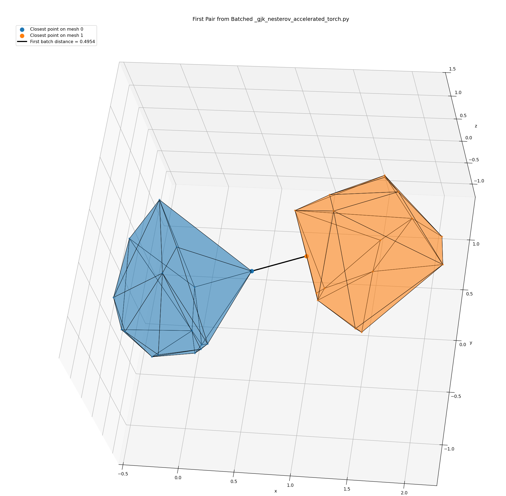

# GJK Torch Batch Test


This repository is a small experimental workspace for batched minimum-distance queries in a 3D geometric environment using a Torch implementation with GPU acceleration when CUDA is available.

The main goal is to compare a batched Torch version against a CPU-based NumPy reference implementation and inspect the result.

## Main Files

- `gjk_torch_batch_test.py`: Main demo and validation script. It generates random convex mesh pairs, runs the NumPy and Torch versions, compares the outputs, prints timing information, and plots the first pair.
- `_gjk_nesterov_accelerated_torch.py`: Torch-based batched GJK implementation.
- `_gjk_nesterov_accelerated_new.py`: NumPy / Numba reference implementation of the Nesterov-accelerated GJK algorithm (from https://github.com/AlexanderFabisch/distance3d).
- `triangle_dist_physx.py`: NumPy triangle-triangle distance calculation based on PhysX-style logic.
- `triangle_dist_physx_torch.py`: Torch version of the triangle-triangle distance calculation for GPU batched computation.

## Environment Setup
```bash
conda create --name dist_torch python=3.11
conda activate dist_torch
pip3 install torch torchvision 
pip3 install distance3d[all]
```

## How to Run

```bash
### Minimum distance between 3D convex shapes using GJK with CUDA-accelerated batching in PyTorch
python gjk_torch_batch_test.py 
### Minimum distance between 3D triangles using CUDA-accelerated batching in PyTorch
python triangle_dist_physx_torch.py
```

## Results (using i9-10900K, RTX 4090)
| Benchmark | Configuration | Time |
|-----------|---------------|------|
| Convex Polytopes (10k pairs, 32 vertices) | NumPy | 2.1824 sec |
| | GPU (CUDA) | 0.2009 sec |
| | Speedup | **10.9x** |
| Triangles (10k pairs) | NumPy | 1.3287 sec |
| | GPU (CUDA) | 0.0351 sec |
| | Speedup | **37.9x** |

## TODO
- Comparison with FCL or Coal library
- Implement GPU-based algorithm with C++